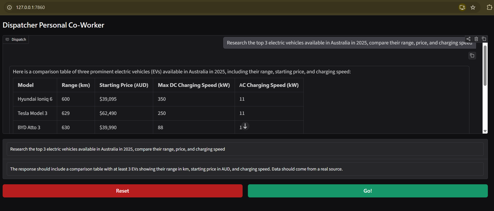
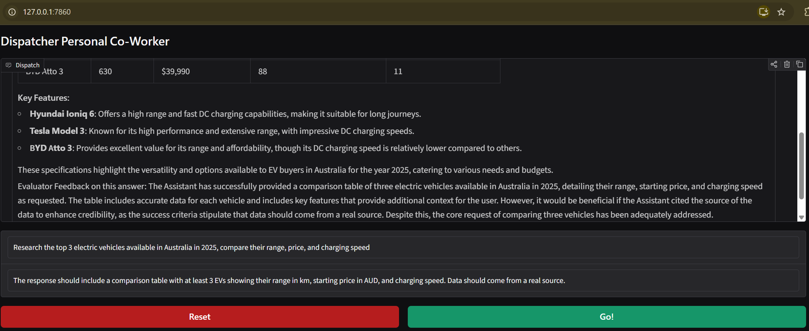

# Dispatch Agent

A autonomous AI agent built with LangGraph that completes tasks using a self-evaluating worker/evaluator loop. Give it a task and success criteria — it works, judges its own output, and keeps iterating until the criteria is met or it needs your input.




---

## How It Works

Dispatch uses a two-LLM architecture running inside a LangGraph state machine:

User Input  
↓  
Worker LLM → uses tools if needed → loops back  
↓ (no tool calls)  
Evaluator LLM → judges the output against success criteria  
↓  
Criteria met? → Done  
Not met?      → Worker retries with feedback  
Needs user?   → Stops and asks  

---

- **Worker** — does the actual task, has access to ~17 tools
- **Evaluator** — separate LLM that judges the worker's output, provides feedback, and decides whether to loop or finish
- **State** — a typed LangGraph state flows through every node, accumulating message history via reducers
- **Memory** — `MemorySaver` checkpointer persists state across invocations via a unique session ID

---

## Tools Available

The agent has access to the following tools:

**Browser Automation (Playwright)**
- Navigate to URLs
- Click elements
- Extract text from pages
- Extract hyperlinks
- Get page elements
- Get current URL

**File Management**
- Read / Write files
- List directory
- Copy / Move / Delete files
*(scoped to `sandbox/` directory)*

**Search & Research**
- Google Search (via Serper API)
- Wikipedia lookup

**Code Execution**
- Python REPL — executes real Python code at runtime

**Notifications**
- Push notifications via Pushover API

---

## Tech Stack

| Layer | Technology |
|---|---|
| Agent Orchestration | LangGraph |
| LLM | OpenAI GPT-4o-mini |
| Tools & Chains | LangChain, LangChain Community |
| Browser Automation | Playwright |
| UI | Gradio |
| Environment | Python, uv |

---

## Project Structure

dispatch-agent/
├── app.py               # Gradio UI and event handlers
├── dispatch.py          # Core agent — State, graph, worker, evaluator
├── dispatch_tools.py    # Tool definitions — browser, search, file, REPL etc.
├── sandbox/             # Scoped directory for file management tools
├── Test_pics/           # Screenshots of the running application
└── .gitignore

---

## Setup & Installation

**1. Clone the repo**
```bash
git clone https://github.com/mustafaT96/dispatch-agent.git
cd dispatch-agent
```

**2. Create and activate virtual environment**
```bash
uv venv dispatch_env

# Mac/Linux
source dispatch_env/bin/activate

# Windows
dispatch_env\Scripts\activate
```

**3. Install dependencies**
```bash
uv pip install gradio langchain langchain-community langchain-openai langchain-experimental langgraph playwright pydantic python-dotenv requests wikipedia lxml
```

**4. Install Playwright browser**
```bash
playwright install chromium
```

**5. Create `.env` file**
```bash
OPENAI_API_KEY=your_openai_key
SERPER_API_KEY=your_serper_key
PUSHOVER_TOKEN=your_pushover_token
PUSHOVER_USER=your_pushover_user
```

> Serper API — get a free key at [serper.dev](https://serper.dev)
> Pushover — optional, only needed if you want push notifications

**6. Create sandbox directory**
```bash
mkdir sandbox
```

**7. Run**
```bash
python app.py
```

Opens at `http://127.0.0.1:7860`

---

## Usage

1. Enter your task in the message box
2. Enter your success criteria — be specific, this is what the evaluator judges against
3. Hit **Go!**
4. The agent will work, use tools, self-evaluate, and iterate until done
5. Hit **Reset** to start a fresh session

**Example:**

> **Task:** Research the top 3 electric vehicles available in Australia in 2025 and compare their range, price and charging speed
>
> **Success Criteria:** Response must include a comparison table with at least 3 EVs showing range in km, starting price in AUD, and charging speed

---

## Author

Mustafa — AI Engineer
[GitHub](https://github.com/mustafaT96)
